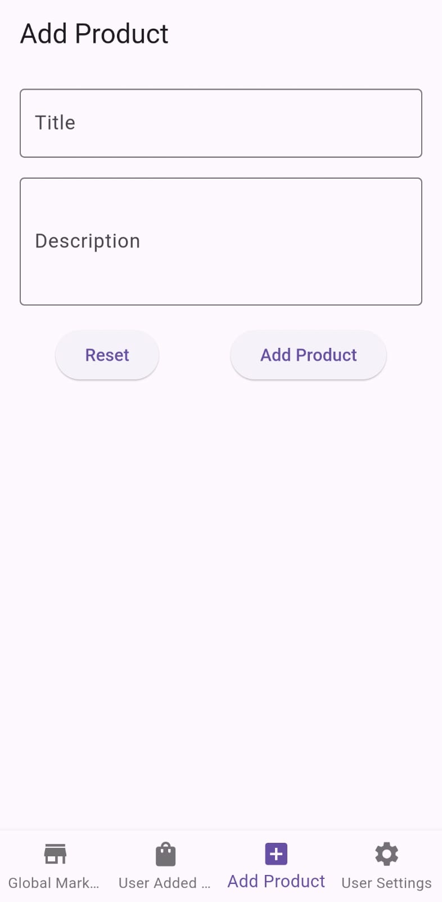

# Flutter Firebase Global Market App

## Overview

Welcome to the Flutter Firebase Global Market App! This application allows users to explore a global marketplace while providing a separate area to view products added by individual users. Built with Flutter and powered by Firebase.

App can be downloaded from [Google Drive](https://drive.google.com/file/d/1_1fYpB-M_We0osQGwxJJiOu4gOLaYuXb/view?usp=sharing)


## Features

- **Global Marketplace**: View products available in a global market area, allowing users to discover new items from around the world.
- **User-Specific Area**: Each user has a dedicated space to add and manage their products, making it easy to keep track of personal listings.
- **Firebase Integration**: Leverage Firebase's real-time database for seamless data storage, retrieval, and user authentication.
- **User Authentication**: Secure user login and registration using Firebase Authentication.

## Technologies Used

- Flutter: Framework for building the app UI.
- Firebase: Backend services, including Firestore for database management, Firebase Authentication for user management.
- Dart: Programming language used to develop the application.

## Screenshots


<h3>Screenshots</h3>

<div style="display: flex; flex-wrap: wrap; justify-content: space-between;">
    
    
    
    
    
    
</div>


## Getting Started

To clone and run this project locally, follow these steps:

### Prerequisites

- Flutter SDK installed on your machine
- An IDE (such as Android Studio or Visual Studio Code) configured for Flutter development

### Clone the Repository

To clone the repository, run the following command:

```bash
git clone https://github.com/shashank77665/marketplace.git
```
- Navigate to Project directory

```bash
cd marketplace
```


- Clean the Project
```bash
flutter clean
```
- Get dependencies

```bash
flutter pub get
```

- Run Project

```bash
Flutter run
```


## Contributing
I welcome contributions! If you would like to contribute to TrackMate, please fork the repository and submit a pull request.

- Steps to Contribute
- Fork the repository.
- Create your feature branch (git checkout -b feature/YourFeature).
- Commit your changes (git commit -m 'Add some feature').
- Push to the branch (git push origin feature/YourFeature).
- Open a pull request.